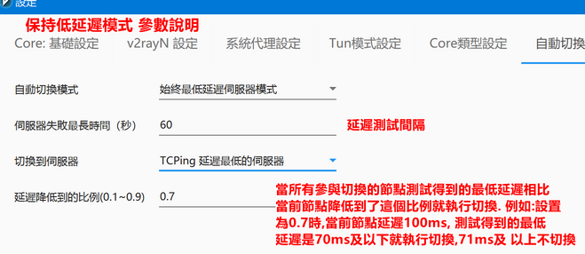

程式碼基於[1]:https://github.com/2dust/v2rayN
增加了"自動切換節點功能"
目前支援
1.故障自動切換模式
2.主-備模式 
3.始終最低延遲模式

使用方法:
1.在節點清單勾選需要參與切換的節點
2.開啟"自動切換"開關

如果需要大量勾選節點,請在"節點過濾框(支援正規表示式)" 中輸入需要過濾內容,關鍵字以垂直線隔開,例如"美國|日本",然後回車,接著勾選表頭"切換框"前面的"勾選方塊" 即可快速大量選取節點.

調整參數的方法:    設定->參數設定->自動切換設定

主-備模式的工作邏輯
1.節點切換時優先使用"主節點"
2.當前節點為"備用節點"時,測試主節點的
可用性,如可用則切換回主節點

主-備模式的參數設定方法

保持低延遲模式的工作邏輯:
根據設定間隔不斷測試所有參與切換節點的延遲,當測試得到的最低延遲低於當前節點延遲的設定比例後執行切換到最低延遲節點

保持低延遲模式的參數設定方法

