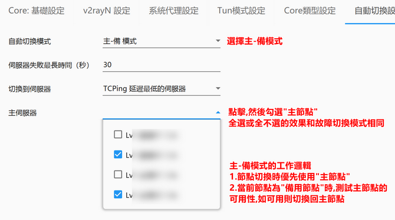

程式碼基於[1]:https://github.com/2dust/v2rayN
增加了"自動切換節點功能"
目前支援"故障自動切換模式"  "主-備模式"    未來會增加"始終最低延遲模式"

使用方法:
1.在節點清單勾選需要參與切換的節點
2.開啟"自動切換"開關

如果需要大量勾選節點,請在"節點過濾框(支援正規表示式)" 中輸入需要過濾內容,關鍵字以垂直線隔開,例如"美國|日本",然後回車,接著勾選表頭"切換框"前面的"勾選方塊" 即可快速大量選取節點.

調整參數的方法:    設定->參數設定->自動切換設定

主-備模式的工作邏輯
1.節點切換時優先使用"主節點"
2.當前節點為"備用節點"時,測試主節點的
可用性,如可用則切換回主節點

主-备模式的参数设置方法

